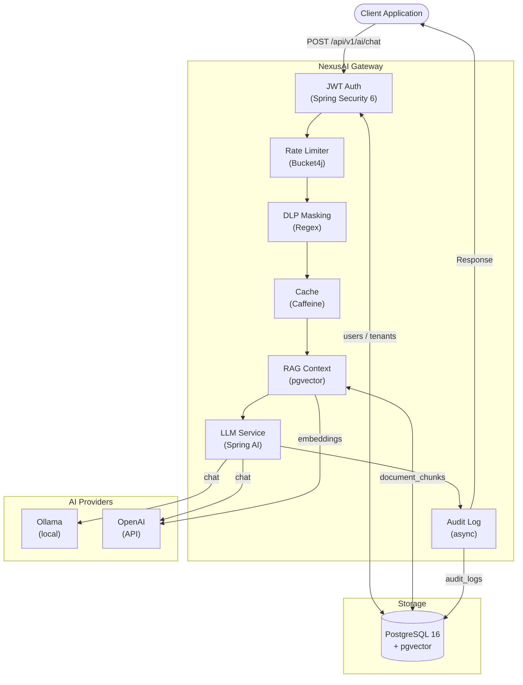

# Architecture Diagram

```mermaid
graph TB
    Client([Client Application])

    subgraph gateway["NexusAI Gateway"]
        direction TB
        Auth["JWT Auth\n(Spring Security 6)"]
        Rate["Rate Limiter\n(Bucket4j)"]
        DLP["DLP Masking\n(Regex)"]
        Cache["Cache\n(Caffeine)"]
        RAG["RAG Context\n(pgvector)"]
        LLM["LLM Service\n(Spring AI)"]
        Audit["Audit Log\n(async)"]
    end

    subgraph storage["Storage"]
        DB[("PostgreSQL 16\n+ pgvector")]
    end

    subgraph providers["AI Providers"]
        Ollama["Ollama\n(local)"]
        OpenAI["OpenAI\n(API)"]
    end

    Client -->|POST /api/v1/ai/chat| Auth
    Auth --> Rate
    Rate --> DLP
    DLP --> Cache
    Cache --> RAG
    RAG --> LLM
    LLM --> Audit
    Audit -->|Response| Client

    Auth <-->|users / tenants| DB
    RAG <-->|document_chunks| DB
    Audit -->|audit_logs| DB

    LLM -->|chat| Ollama
    LLM -->|chat| OpenAI
    RAG -->|embeddings| OpenAI
```
