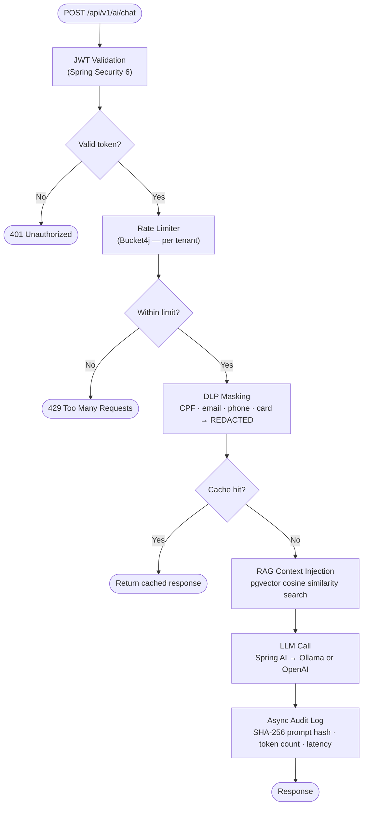

# Request Pipeline

```mermaid
flowchart TD
    A(["POST /api/v1/ai/chat"])
    A --> B["JWT Validation\n(Spring Security 6)"]

    B --> C{Valid token?}
    C -- No --> E1(["401 Unauthorized"])
    C -- Yes --> D["Rate Limiter\n(Bucket4j — per tenant)"]

    D --> F{Within limit?}
    F -- No --> E2(["429 Too Many Requests"])
    F -- Yes --> G["DLP Masking\nCPF · email · phone · card → REDACTED"]

    G --> H{Cache hit?}
    H -- Yes --> E3(["Return cached response"])
    H -- No --> I["RAG Context Injection\npgvector cosine similarity search"]

    I --> J["LLM Call\nSpring AI → Ollama or OpenAI"]
    J --> K["Async Audit Log\nSHA-256 prompt hash · token count · latency"]
    K --> L(["Response"])
```
